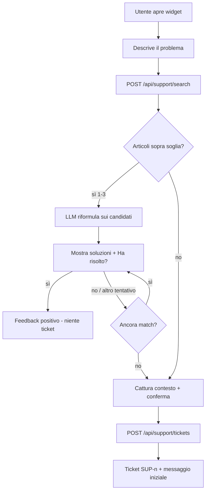

# Supporto tecnico FDM — Fase 0: piano tecnico

> **Stato:** implementato (Fasi 1–7 nel working tree). Accendere
> `site_settings.support_bot_enabled` per Spazio dopo `supabase db push`
> delle migration `20260824120000` e `20260824130000`. Flag spento = nessuna UI.
>
> Data: 2026-08-24. Spazio di riferimento: Santini. Stack: Next.js +
> Supabase (RLS), gerarchia Organizations → Sites ("Spazi") → Users.

---

## 0. Baseline esistente (da riusare, non da rifare)

Il piano è **additivo** rispetto a quanto già in produzione.

| Esistente | Ruolo nel piano |
| --- | --- |
| `site_settings.support_bot_enabled` (toggle superadmin in `SiteSupportAndSubscriptionModal`) | Feature flag per-spazio. Widget spento se `false`/assente → **zero impatto** sugli Spazi live. |
| `public.user_can_access_site(uuid)` | Isolamento tenant su tutte le nuove tabelle con `site_id`. |
| `public.user_is_site_admin(uuid)` | Admin/superadmin dello Spazio (già usato da fatturazione readiness). |
| `public.is_superadmin()` | Inbox globale Manager dei Manager. |
| `pg_trgm` (schema `public`, già nel baseline) | Fuzzy matching KB. **Non** va ri-creata l'estensione. |
| Config FTS `italian` (built-in Postgres) | Dizionario default per `tsvector` / `tsquery`. |
| `ANTHROPIC_API_KEY` + `lib/ai/anthropic-models.ts` (`claude-sonnet-4-6`) | Riformulazione server-side dopo il retrieval. Chiave mai al client. |
| `ErrorBoundary` + `app/sites/[domain]/error.tsx` | Punto d'innesto "Segnala questo errore". |
| Realtime `postgres_changes` (pattern Kanban/Overview) | Badge ticket senza polling. |
| `PageLayout` / `PageHeader` / token `bg-page`, accento sky | UI admin e "I miei ticket". |
| `SITE_NAV_GROUPS` gruppo `configurazione` (`minRole: "admin"`) | Voce menù per-spazio. |
| `lib/admin-nav-config.ts` | Voce inbox globale in Administration. |
| `app/api/support/tickets/route.ts` (webhook `SUPPORT_TICKET_WEBHOOK_URL`) | Canale outbound opzionale, non più sorgente di verità. |
| Widget Vera/Mira/Aura (`GlobalSupportAssistant`, dock in alto a destra) | **Resta**. Il supporto tecnico è un widget distinto in basso a destra. |

### Cosa non è questo sistema

- **Modulo Errortracking** (`/errortracking`): errori di produzione su task/prodotti, non bug dell'app.
- **Assistenti Vera/Mira/Aura**: copiloti operativi con knowledge in-memory da markdown. Non hanno persistenza ticket né RLS KB. Restano indipendenti; in una fase successiva si potrà collegare un intent "segnala un problema" che apre il widget supporto.

### Impatto sugli Spazi live

Nessuna `ALTER` distruttiva. Flag spento di default. Rollback di ogni fase = `DROP` delle sole entità nuove (o nascondere UI + flag `false`).

---

## 1. Schema DB proposto

### 1.1 Diagramma entità

```
organizations
    └── sites
          ├── support_categories          (site_id NULL = globale)
          ├── support_conversations       (1 sessione chat)
          │     ├── support_messages
          │     └── support_tickets       (0..1, solo se escalation)
          │           └── support_ticket_events
          ├── support_kb_articles         (site_id NULL = globale)
          │     └── support_kb_feedback
          └── storage.objects bucket "support"
```

### 1.2 Enumerazioni (CHECK, non enum Postgres)

Evita `CREATE TYPE` per restare additivi e rollback-friendly.

| Entità | Campo | Valori |
| --- | --- | --- |
| Ticket | `status` | `open`, `in_progress`, `waiting_user`, `resolved`, `closed` |
| Ticket | `priority` | `low`, `normal`, `high`, `urgent` |
| Ticket | `source` | `widget`, `error_boundary`, `admin` |
| Conversation | `status` | `self_service`, `escalated`, `abandoned` |
| Message | `role` | `user`, `bot`, `agent`, `system` |
| KB article | `status` | `draft`, `published`, `archived` |

Transizioni ticket ammesse (enforce in API, non in DB):

```
open → in_progress → waiting_user ⇄ in_progress
                 ↘ resolved → closed
open → closed          (chiusura senza lavorazione)
resolved → open        (riapertura)
```

### 1.3 DDL proposto

Nomi snake_case, UUID, `timestamptz`, `set_updated_at()` già presente. FK `created_by` verso `auth.users(id)` (stesso pattern di `manager_project_stage_events`). Join anagrafica via `"User".auth_id` / `"User"."authId"`.

```sql
-- =====================================================================
-- FASE A — ticketing
-- =====================================================================

CREATE TABLE public.support_categories (
  id            uuid PRIMARY KEY DEFAULT gen_random_uuid(),
  site_id       uuid REFERENCES public.sites(id) ON DELETE CASCADE,
  slug          text NOT NULL,
  label         text NOT NULL,
  sort_order    integer NOT NULL DEFAULT 0,
  is_active     boolean NOT NULL DEFAULT true,
  created_at    timestamptz NOT NULL DEFAULT now(),
  CONSTRAINT support_categories_slug_site_unique UNIQUE (site_id, slug)
);
-- UNIQUE parziale per le globali (site_id NULL):
CREATE UNIQUE INDEX support_categories_global_slug_uidx
  ON public.support_categories (slug) WHERE site_id IS NULL;

CREATE TABLE public.support_conversations (
  id              uuid PRIMARY KEY DEFAULT gen_random_uuid(),
  site_id         uuid NOT NULL REFERENCES public.sites(id) ON DELETE CASCADE,
  organization_id uuid REFERENCES public.organizations(id) ON DELETE SET NULL,
  created_by      uuid NOT NULL REFERENCES auth.users(id) ON DELETE CASCADE,
  status          text NOT NULL DEFAULT 'self_service'
                    CHECK (status IN ('self_service', 'escalated', 'abandoned')),
  user_query      text NOT NULL DEFAULT '',
  context         jsonb NOT NULL DEFAULT '{}'::jsonb,
  -- context: { pathname, module, userAgent, viewport, locale,
  --            assistanceLevel, errorDigest, recentErrors[] }
  created_at      timestamptz NOT NULL DEFAULT now(),
  updated_at      timestamptz NOT NULL DEFAULT now()
);

CREATE INDEX support_conversations_site_user_idx
  ON public.support_conversations (site_id, created_by, created_at DESC);

CREATE TABLE public.support_tickets (
  id              uuid PRIMARY KEY DEFAULT gen_random_uuid(),
  public_number   integer GENERATED BY DEFAULT AS IDENTITY,
  site_id         uuid NOT NULL REFERENCES public.sites(id) ON DELETE CASCADE,
  organization_id uuid REFERENCES public.organizations(id) ON DELETE SET NULL,
  conversation_id uuid NOT NULL UNIQUE
                    REFERENCES public.support_conversations(id) ON DELETE RESTRICT,
  category_id     uuid REFERENCES public.support_categories(id) ON DELETE SET NULL,
  created_by      uuid NOT NULL REFERENCES auth.users(id) ON DELETE CASCADE,
  assigned_to     uuid REFERENCES auth.users(id) ON DELETE SET NULL,
  status          text NOT NULL DEFAULT 'open'
                    CHECK (status IN ('open','in_progress','waiting_user','resolved','closed')),
  priority        text NOT NULL DEFAULT 'normal'
                    CHECK (priority IN ('low','normal','high','urgent')),
  source          text NOT NULL DEFAULT 'widget'
                    CHECK (source IN ('widget','error_boundary','admin')),
  subject         text NOT NULL,
  kb_attempted    boolean NOT NULL DEFAULT false,
  kb_article_ids  uuid[] NOT NULL DEFAULT '{}',
  resolved_at     timestamptz,
  closed_at       timestamptz,
  created_at      timestamptz NOT NULL DEFAULT now(),
  updated_at      timestamptz NOT NULL DEFAULT now()
);

CREATE INDEX support_tickets_site_status_idx
  ON public.support_tickets (site_id, status, created_at DESC);
CREATE INDEX support_tickets_assignee_idx
  ON public.support_tickets (assigned_to) WHERE assigned_to IS NOT NULL;
CREATE INDEX support_tickets_created_by_idx
  ON public.support_tickets (created_by, created_at DESC);

CREATE TABLE public.support_messages (
  id                uuid PRIMARY KEY DEFAULT gen_random_uuid(),
  conversation_id   uuid NOT NULL
                      REFERENCES public.support_conversations(id) ON DELETE CASCADE,
  ticket_id         uuid REFERENCES public.support_tickets(id) ON DELETE SET NULL,
  author_id         uuid REFERENCES auth.users(id) ON DELETE SET NULL,
  role              text NOT NULL
                      CHECK (role IN ('user','bot','agent','system')),
  body              text NOT NULL,
  kb_article_ids    uuid[] NOT NULL DEFAULT '{}',
  attachments       jsonb NOT NULL DEFAULT '[]'::jsonb,
  -- attachments: [{ path, mime, size, kind: 'screenshot'|'file' }]
  created_at        timestamptz NOT NULL DEFAULT now()
);

CREATE INDEX support_messages_conversation_idx
  ON public.support_messages (conversation_id, created_at);

CREATE TABLE public.support_ticket_events (
  id          uuid PRIMARY KEY DEFAULT gen_random_uuid(),
  ticket_id   uuid NOT NULL REFERENCES public.support_tickets(id) ON DELETE CASCADE,
  actor_id    uuid REFERENCES auth.users(id) ON DELETE SET NULL,
  event_type  text NOT NULL,
  -- status_change | assign | priority_change | kb_convert
  from_value  text,
  to_value    text,
  created_at  timestamptz NOT NULL DEFAULT now()
);

CREATE INDEX support_ticket_events_ticket_idx
  ON public.support_ticket_events (ticket_id, created_at DESC);

-- =====================================================================
-- FASE B — knowledge base (migration separata, commit 4)
-- =====================================================================

CREATE TABLE public.support_kb_articles (
  id              uuid PRIMARY KEY DEFAULT gen_random_uuid(),
  site_id         uuid REFERENCES public.sites(id) ON DELETE CASCADE,
  -- NULL = articolo globale, visibile a tutti gli Spazi
  category_id     uuid REFERENCES public.support_categories(id) ON DELETE SET NULL,
  title           text NOT NULL,
  body_md         text NOT NULL DEFAULT '',
  tags            text[] NOT NULL DEFAULT '{}',
  status          text NOT NULL DEFAULT 'draft'
                    CHECK (status IN ('draft','published','archived')),
  source_ticket_id uuid REFERENCES public.support_tickets(id) ON DELETE SET NULL,
  published_at    timestamptz,
  created_by      uuid REFERENCES auth.users(id) ON DELETE SET NULL,
  updated_by      uuid REFERENCES auth.users(id) ON DELETE SET NULL,
  created_at      timestamptz NOT NULL DEFAULT now(),
  updated_at      timestamptz NOT NULL DEFAULT now(),
  -- Full-text italiano, generated, mantenuto da Postgres
  search_tsv      tsvector GENERATED ALWAYS AS (
                    setweight(to_tsvector('italian', coalesce(title, '')), 'A') ||
                    setweight(to_tsvector('italian', coalesce(array_to_string(tags, ' '), '')), 'B') ||
                    setweight(to_tsvector('italian', coalesce(body_md, '')), 'C')
                  ) STORED
  -- PUNTO D'INNESTO FUTURO (NON in questa fase):
  -- embedding vector(1536)  -- richiede CREATE EXTENSION vector
);

CREATE INDEX support_kb_articles_tsv_gin
  ON public.support_kb_articles USING GIN (search_tsv);
CREATE INDEX support_kb_articles_tags_gin
  ON public.support_kb_articles USING GIN (tags);
CREATE INDEX support_kb_articles_trgm_title
  ON public.support_kb_articles USING GIN (title gin_trgm_ops);
CREATE INDEX support_kb_articles_site_status_idx
  ON public.support_kb_articles (site_id, status);

CREATE TABLE public.support_kb_feedback (
  id          uuid PRIMARY KEY DEFAULT gen_random_uuid(),
  article_id  uuid NOT NULL REFERENCES public.support_kb_articles(id) ON DELETE CASCADE,
  site_id     uuid NOT NULL REFERENCES public.sites(id) ON DELETE CASCADE,
  user_id     uuid NOT NULL REFERENCES auth.users(id) ON DELETE CASCADE,
  conversation_id uuid REFERENCES public.support_conversations(id) ON DELETE SET NULL,
  resolved    boolean NOT NULL,
  created_at  timestamptz NOT NULL DEFAULT now(),
  CONSTRAINT support_kb_feedback_once UNIQUE (article_id, user_id, conversation_id)
);
```

Numero visibile all'utente: `SUP-{public_number}` (identità globale, semplice, unicità garantita).

`organization_id` è denormalizzato (riempito in INSERT dal `sites.organization_id`) per filtrare l'inbox MoM senza join extra. Non è la sorgente di verità del tenant: lo è `site_id`.

### 1.4 Seed categorie globali

```sql
INSERT INTO public.support_categories (site_id, slug, label, sort_order) VALUES
  (NULL, 'accesso',       'Accesso e permessi',     10),
  (NULL, 'kanban',        'Kanban e task',          20),
  (NULL, 'produzione',    'Produzione e magazzino', 30),
  (NULL, 'documenti',     'Documenti e listino',    40),
  (NULL, 'anagrafiche',   'Anagrafiche',            50),
  (NULL, 'altro',         'Altro',                  90);
```

### 1.5 Storage screenshot

Nuovo bucket **privato** `support` (non riusare `files`, che è pubblico). Path:

```
{site_id}/{conversation_id}/{uuid}.{ext}
```

Limite 5 MB, MIME `image/png|jpeg|webp`, `application/pdf`. RLS storage: stesso helper `get_site_id_from_storage_path` già usato da `documents`; SELECT/INSERT se `user_can_access_site` **e** (proprietario conversazione **o** `user_is_site_admin`).

### 1.6 RLS

Pattern: `ENABLE ROW LEVEL SECURITY` + policy `TO authenticated`. Nessun accesso `anon`.

Helper aggiuntivo (additivo, non modifica gli esistenti):

```sql
CREATE OR REPLACE FUNCTION public.user_owns_support_conversation(target_id uuid)
RETURNS boolean
LANGUAGE sql STABLE SECURITY DEFINER
SET search_path TO public
AS $$
  SELECT EXISTS (
    SELECT 1 FROM public.support_conversations c
    WHERE c.id = target_id
      AND c.created_by = auth.uid()
      AND public.user_can_access_site(c.site_id)
  );
$$;
```

| Tabella | SELECT | INSERT | UPDATE | DELETE |
| --- | --- | --- | --- | --- |
| `support_categories` | `site_id IS NULL OR user_can_access_site(site_id)` | superadmin (globali); `user_is_site_admin` (di Spazio) | stesso | stesso |
| `support_conversations` | owner **oppure** `user_is_site_admin(site_id)` **oppure** `is_superadmin()`; sempre `user_can_access_site` salvo superadmin | owner + `user_can_access_site`; `created_by = auth.uid()` | owner (solo `self_service`) o admin sito / superadmin | no (soft: `abandoned`) |
| `support_tickets` | come conversazione | owner in escalation, `created_by = auth.uid()` | admin sito / superadmin (stato, assignee, priority); owner solo se `waiting_user` (reply, non cambio stato admin) | no |
| `support_messages` | visibilità della conversazione padre | owner (role `user`); bot via route server (service o SECURITY DEFINER); agent se admin sito / superadmin | no | no |
| `support_ticket_events` | visibilità del ticket | trigger SECURITY DEFINER | no | no |
| `support_kb_articles` | `status = 'published' AND (site_id IS NULL OR user_can_access_site)` **oppure** (bozze: `user_is_site_admin` dello `site_id`, o `is_superadmin` per globali) | admin sito (solo `site_id` proprio); superadmin (anche `site_id` NULL) | stesso | no (archivia) |
| `support_kb_feedback` | owner della riga, o admin sito / superadmin | `user_id = auth.uid()` + articolo visibile | no | no |

**Utente collaboratore (`role = user`)**: vede solo i propri ticket/conversazioni del proprio Spazio.

**Admin dello Spazio**: vede tutti i ticket di quello Spazio (gestione).

**Superadmin / Manager dei Manager**: vede tutto, tutti gli Spazi. `is_superadmin()` bypassa il filtro sito (come su `manager_projects`).

Le policy **non** usano `User.role = 'admin'` in modo globale senza `user_can_access_site`: un admin di un'altra org non vede i ticket Santini.

### 1.7 Funzione di ricerca KB (security invoker)

```sql
CREATE OR REPLACE FUNCTION public.search_support_kb(
  p_site_id uuid,
  p_query   text,
  p_limit   integer DEFAULT 3
)
RETURNS TABLE (
  id uuid,
  title text,
  body_md text,
  rank real,
  trgm_sim real
)
LANGUAGE sql
STABLE
SECURITY INVOKER
AS $$
  WITH q AS (
    SELECT websearch_to_tsquery('italian', p_query) AS tsq,
           plainto_tsquery('italian', p_query) AS tsq_plain
  )
  SELECT a.id, a.title, a.body_md,
         ts_rank(a.search_tsv, COALESCE(NULLIF(q.tsq, ''::tsquery), q.tsq_plain)) AS rank,
         similarity(a.title, p_query) AS trgm_sim
  FROM public.support_kb_articles a, q
  WHERE a.status = 'published'
    AND (a.site_id IS NULL OR a.site_id = p_site_id)
    AND (
      a.search_tsv @@ COALESCE(NULLIF(q.tsq, ''::tsquery), q.tsq_plain)
      OR similarity(a.title, p_query) > 0.35
      OR a.title ILIKE '%' || p_query || '%'
    )
  ORDER BY rank DESC, trgm_sim DESC
  LIMIT p_limit;
$$;
```

La RLS di `support_kb_articles` filtra già i non-visibili (`SECURITY INVOKER`).

Soglia di "match utile" (applicazione, non SQL): **`rank >= 0.08` oppure `trgm_sim >= 0.4`**. Sotto soglia → niente LLM, vai al ticket.

---

## 2. Architettura del chatbot

### 2.1 Flusso (KB prima del ticket)



Stati UI del pannello: `idle` → `searching` → `kb_results` → `confirm_ticket` → `ticket_open` | `resolved_kb`.

### 2.2 Matching: perché la cascata fissata

| Approccio | Costo/query | Qualità | Quando |
| --- | --- | --- | --- |
| Keyword in-memory (oggi `AssistantKnowledgeService`) | 0 | Bassa, non multi-tenant | Da **non** riusare per il supporto |
| Full-text Postgres `italian` + `pg_trgm` | 0 | Buona su termini esatti/typo | **Retrieval di questa fase** |
| Embeddings `pgvector` | embedding query + storage | Alta su parafrasi | Fase futura, schema già pronto |
| LLM come retriever | alto, ogni messaggio | Alta UX, allucinazioni su corpus | Scartato per il retrieval |

**Cascata consigliata (vincolo di prodotto):**

1. Retrieval Postgres (gratis, veloce, RLS nativa).
2. Se `rank` / similarità sotto soglia → **skip LLM**, form ticket. Zero costo sprecato.
3. Se 1–3 candidati → `claude-sonnet-4-6` **solo** per riformulare in italiano, citando titolo articolo, senza inventare procedure assenti dal `body_md`.
4. Il modello riceve i candidati come unico contesto. System prompt: "Se gli articoli non coprono la domanda, rispondi NEED_TICKET".

Stima costo riformulazione (Sonnet 4.6, ~3k token in / 400 out): circa **0,01–0,02 USD** per hit KB. Con 50 segnalazioni/mese di cui 30% con match: < 1 USD/mese. Retrieval sempre a costo zero.

Chiave: `ANTHROPIC_API_KEY` env (fallback piattaforma, come documenti). Non usare `site_ai_settings` del generatore documenti: il supporto è un servizio FDM, non una feature verticale dello Spazio.

### 2.3 Route API (tutte server-side, `getUserContext` + check sito)

| Metodo | Path | Scopo |
| --- | --- | --- |
| `POST` | `/api/support/conversations` | Apre sessione, salva `context` |
| `POST` | `/api/support/search` | Retrieval + eventuale LLM; scrive messaggi bot |
| `POST` | `/api/support/feedback` | "Ha risolto?" → `support_kb_feedback` |
| `POST` | `/api/support/tickets` | Escalation: crea ticket, snapshot conversazione |
| `GET` | `/api/support/tickets` | Lista (filtri: miei / sito / global se superadmin) |
| `GET` | `/api/support/tickets/[id]` | Dettaglio + messaggi |
| `POST` | `/api/support/tickets/[id]/messages` | Reply utente o agent |
| `PATCH` | `/api/support/tickets/[id]` | Stato / priorità / assignee (admin) |
| `POST` | `/api/support/tickets/[id]/convert-kb` | Ticket → bozza articolo |
| `POST` | `/api/support/upload` | Screenshot sul bucket `support` |
| CRUD | `/api/support/kb` | Solo admin/superadmin |

L'attuale `POST /api/support/tickets` (webhook) viene **esteso**: dopo INSERT locale, se `SUPPORT_TICKET_WEBHOOK_URL` è settato, si inoltra il payload (compatibilità Matris). La sorgente di verità diventa Supabase.

### 2.4 Contratto LLM (riformulazione)

Input: `query`, array `{ title, body_md }` (max 3, body troncato a 4k char).

Output JSON:

```json
{
  "mode": "answer" | "need_ticket",
  "reply": "testo markdown breve",
  "articleIds": ["..."]
}
```

`need_ticket` se il modello ritiene i candidati non pertinenti (seconda rete di sicurezza oltre `ts_rank`).

---

## 3. UI/UX

### 3.1 Widget utente (tutte le route `/sites/[domain]/**`)

- FAB fisso **in basso a destra** (`Headset` lucide), z-index sotto i dialog ma sopra la pagina. Non collide col dock Vera/Mira/Aura (alto a destra) né col Command Deck in sidebar.
- Visibile solo se `support_bot_enabled === true` per lo Spazio (stesso pattern di `commandDeckEnabled` in `QueryHydration`).
- Pannello: `Sheet` side=right, token `bg-card` / `border-border`, accento sky. Larghezza ~400px desktop; full-width mobile.
- Contenuto: thread messaggi, textarea, clip screenshot, chip categoria (dopo il search).
- CTA risultati KB: **"Ha risolto il problema?"** Sì / No.
- Form conferma ticket: oggetto precompilato (primi 80 char della query), categoria, priorità suggerita (urgent se da error boundary), anteprima contesto (pathname, browser) in accordion chiuso, submit.
- Link "I miei ticket" in footer del pannello.

Montaggio: `app/sites/[domain]/layout.tsx` (non `app/providers.tsx`), così il widget ha `siteId`/`domain` certi e non compare su `/administration` o login.

### 3.2 Vista utente "I miei ticket"

- Route: `/sites/[domain]/supporto` (o `/assistenza`).
- Voce **non** nel gruppo Configurazione (quello è `minRole: admin`). Link dal widget + opzionale item in fondo sidebar visibile a tutti i ruoli, senza `moduleName` (sempre on se flag on).
- `PageLayout` + lista filtri stato. Click → dettaglio thread (stesso componente messaggi del widget).

### 3.3 Admin per-spazio (Configurazione)

- Nuova voce in `SITE_NAV_GROUPS` gruppo `configurazione`: **Supporto** → `/supporto/gestione`.
- `minRole: "admin"` già sul gruppo: i collaboratori non la vedono.
- Lista filtrabile: stato, priorità, categoria, assignee, testo. Badge count aperti nella voce menù (`SidebarMenuBadge`).
- Pannello dettaglio: thread, cambio stato, risposta, "Converti in articolo KB" (fase 7).
- Metriche KB (fase 7): tabella articoli con % "ha risolto" / "non ha risolto"; banner "N ticket aperti sulla stessa categoria questa settimana → crea articolo".

### 3.4 Superadmin / Manager dei Manager

- Voce in `ADMIN_NAV_ITEMS`: **Supporto** → `/administration/support`. `superadminOnly: true`.
- Stessa UI lista con colonna **Spazio**. Filtra per `site_id` / organizzazione.
- CRUD articoli **globali** (`site_id` NULL) solo qui. Gli admin di Spazio CRUD-ano solo articoli del proprio `site_id`.

### 3.5 Componenti da creare (riuso DS)

| Componente | Dove |
| --- | --- |
| `SupportWidget` + `SupportFab` | `components/support/` |
| `SupportChatThread` | condiviso widget / dettaglio |
| `SupportKbSuggestions` | card articoli + Sì/No |
| `SupportTicketConfirmForm` | conferma escalation |
| `SupportTicketsTable` | liste utente/admin |
| `SupportTicketDetail` | thread + azioni admin |
| `SupportKbEditor` | markdown title/body/tags/status |
| `SupportKbMetrics` | utilità articoli |

Niente `bg-slate-*` / hex: token del design system (`ui-standardization`).

---

## 4. Cattura automatica del contesto d'errore

### 4.1 Contesto sempre allegato (anche senza crash)

Alla creazione conversazione il client invia, validato server-side:

- `site_id`, `domain`, `organization_id` (il server **sovrascrive** dal record `sites`, non si fida del client)
- `pathname`, `search` (senza token), modulo da `SITE_NAV_GROUPS` match sull'href
- `userAgent`, `viewport`, `locale` (`getSiteLocale`)
- `assistanceLevel`, `role`
- `recentErrors[]`: ring buffer client (max 10, 30 min TTL) di `message`, `stack` truncato, `digest`, timestamp

### 4.2 Intercettori

1. **`ErrorBoundary` / `PageErrorFallback` / `app/sites/[domain]/error.tsx`**: bottone "Segnala questo errore" che dispatcha `open-support-widget` con `{ source: 'error_boundary', errorDigest, message }`. Precompila la query.
2. **`window.onerror` + `unhandledrejection`**: hook `useSupportErrorBuffer` montato nel site layout. Non apre il widget da solo (evita loop). Solo buffer.
3. **Console**: non si intercetta `console.error` in produzione (troppo rumoroso). Solo Error Boundary + window handlers.
4. **Screenshot opzionale**: `html2canvas` è pesante. Fase 2: input file + paste. Fase successiva: `getDisplayMedia` (permesso utente) o cattura viewport. Mai screenshot automatico silenzioso.

Il server ignora campi extra e re-deriva identità da `getUserContext()`.

---

## 5. Notifiche

Oggi FDM **non** ha un provider email transazionale (niente Resend/SMTP in codice). Il drawer "NOTIFICHE" è locale su scadenze task. Non si introduce un prodotto email obbligatorio in Fase 0.

| Canale | Fase | Meccanismo |
| --- | --- | --- |
| Badge menù Configurazione / FAB | 3 | `count(*)` ticket `open`+`in_progress` visibili; Realtime `postgres_changes` su `support_tickets` filtrato `site_id=eq.{id}` (stesso pattern Kanban) |
| Toast agent su nuovo messaggio utente | 3 | Realtime su `support_messages` mentre il dettaglio è aperto |
| Webhook outbound | 2 | Riuso `SUPPORT_TICKET_WEBHOOK_URL` + token dopo INSERT (Matris) |
| Email admin | **non in questa ondata** | Predisporre `SUPPORT_NOTIFY_EMAIL` in docs; implementare solo se si sceglie Resend. Evitare SMTP ad hoc. |

Superadmin: badge in Administration = ticket aperti di tutti gli Spazi (query con `is_superadmin`).

---

## 6. Knowledge base — modello ibrido

- `site_id NULL` = articolo **globale** (superadmin). Visibile in ogni Spazio con bot acceso.
- `site_id = <uuid>` = articolo **di Spazio**. Solo utenti con `user_can_access_site`.
- Retrieval: `WHERE site_id IS NULL OR site_id = :current`. Rank naturale: un articolo di Spazio con stesso `ts_rank` vince sul globale (tie-break `site_id IS NOT NULL` first) così le FAQ Santini coprono le globali.

Bozze (`draft`) invisibili al chatbot. Solo `published`.

Tag: `text[]` Postgres, **non** `'{}'` come stringa CSV. Allineato alla convenzione "tag vuoto = array vuoto".

### 6.1 Metriche e loop

Vista (security invoker):

```sql
CREATE VIEW public.support_kb_article_stats
WITH (security_invoker = true) AS
SELECT
  a.id,
  a.site_id,
  a.title,
  a.status,
  count(f.*) FILTER (WHERE f.resolved)     AS resolved_yes,
  count(f.*) FILTER (WHERE NOT f.resolved) AS resolved_no,
  count(t.*)                               AS tickets_from_article
FROM support_kb_articles a
LEFT JOIN support_kb_feedback f ON f.article_id = a.id
LEFT JOIN support_tickets t ON a.id = ANY (t.kb_article_ids)
GROUP BY a.id;
```

Soglia suggerimento "crea articolo": ≥ 3 ticket `open|in_progress` nella stessa `category_id` negli ultimi 14 giorni, senza articolo published con overlap tag/categoria. Banner in UI admin, non job automatico.

### 6.2 Conversione ticket → articolo

`POST /api/support/tickets/[id]/convert-kb`:

- Precompila `title` = subject ticket
- `body_md` = ultimo messaggio `role=agent` se presente, altrimenti concatenazione thread (user+agent, no system)
- `status = draft`, `source_ticket_id = ticket.id`, `site_id = ticket.site_id` (mai globale in automatico: il superadmin può poi "promuovere" togliendo `site_id`)
- Redirect all'editor KB

Non chiude il ticket da solo.

---

## 7. Punto d'innesto semantic search (NON attivare)

`pgvector` **non** è tra le estensioni del progetto (`baseline` ha `pg_trgm`, `pgcrypto`, `uuid-ossp`, non `vector`). Su Supabase è attivabile con `CREATE EXTENSION IF NOT EXISTS vector`.

Quando si deciderà:

1. Migration additiva: `CREATE EXTENSION vector;` + `ALTER TABLE support_kb_articles ADD COLUMN embedding vector(1536);` + indice `ivfflat` / `hnsw`.
2. Job (Edge Function o route admin) che embedda `title || body_md` all'insert/update articolo.
3. `search_support_kb` diventa: FTS per candidati ampi (es. 20) **oppure** `ORDER BY embedding <-> query_embedding`, poi stessa soglia + stesso LLM.

Nessuna colonna placeholder ora: una generated `tsvector` + commento SQL sul punto d'innesto basta. Aggiungere `vector(n)` a vuoto richiederebbe comunque l'estensione.

Modello embedding futuro: da decidere allora (OpenAI `text-embedding-3-small` 1536 vs Anthropic — quest'ultimo non espone embeddings nativi; resterebbe un secondo provider). Per questo la dimensione non viene fissata in tabella oggi.

---

## 8. Feature flag e env

Riuso **senza nuova env pubblica**:

- `site_settings.support_bot_enabled` = `true` → widget + route utente attive per quello Spazio.
- Assente / `false` → widget nullo, route gestione 404 per i non-superadmin (il superadmin può comunque aprire l'inbox globale).

Da documentare in `docs/FEATURE-FLAGS.md` al commit 2:

| Chiave | Dove |
| --- | --- |
| `SUPPORT_TICKET_WEBHOOK_URL` / `SUPPORT_TICKET_WEBHOOK_TOKEN` | già usate; restano opzionali |
| `ANTHROPIC_API_KEY` | già presente; usata anche da `/api/support/search` dalla fase 6 |

Nessun `NEXT_PUBLIC_*` nuovo. Il flag è per-sito, non globale: Santini può accenderlo, gli altri Spazi restano invariati.

---

## 9. Sicurezza e multi-tenant

- Ogni ticket/conversazione ha `site_id` obbligatorio. Widget prende lo Spazio corrente dal layout, mai da input utente.
- Route API ricalcolano `site_id` da `getSiteData(domain)` (stesso guard di `/api/assistants/chat`).
- Anthropic solo server-side. Il client vede `reply`, mai la chiave né il prompt di sistema.
- Screenshot in bucket privato. Path con `site_id` in testa per le policy storage.
- Impersonation: il ticket è dell'utente impersonato (`auth.uid()` della sessione effettiva). Accettabile: il superadmin sta operando "come" quell'utente. Opzionale in `context.originalSuperadminId`.
- Rate limit search/ticket: 20 req / 10 min per utente+sito (in-memory o header), per non bruciare quota LLM.

---

## 10. Elenco componenti / file previsti (post-approvazione)

```
supabase/migrations/20260824xxxxxx_support_ticketing.sql
supabase/migrations/20260824xxxxxx_support_kb.sql
components/support/*
app/sites/[domain]/supporto/page.tsx
app/sites/[domain]/supporto/gestione/page.tsx
app/sites/[domain]/supporto/gestione/kb/page.tsx
app/(administration)/administration/support/page.tsx
app/api/support/**
lib/support/settings.ts          # SUPPORT_BOT_SETTING_KEY, parser (mirror command-deck)
lib/support/search.ts            # soglia rank, chiamata RPC
lib/support/reformulate.ts       # Anthropic, server-only
lib/i18n/messages/it.ts + de.ts  # chiavi nav.support*
```

Nessuna modifica a tabelle esistenti tranne, se serve, **nessuna**: il flag è già in `site_settings`.

---

## 11. Diagramma di flusso chatbot (esteso)

```
[FAB] ──apri──► [Sheet]
                    │
                    ▼
              "Ciao, descrivi il problema"
                    │
                    ▼
         utente: testo (± screenshot)
                    │
                    ▼
         conversation INSERT + context
                    │
                    ▼
         search_support_kb (FTS+trgm)
                    │
          ┌─────────┴─────────┐
          │ match             │ no match
          ▼                   ▼
   reformulate LLM      confirm_ticket
          │                   │
          ▼                   │
   1-3 card + Sì/No           │
          │                   │
     Sì → feedback+close      │
     No → confirm_ticket ◄────┘
                    │
                    ▼
         ticket INSERT status=open
         messages snapshot
         webhook opzionale
         realtime → badge admin
```

---

## 12. Piano di fasi / commit atomici

Ogni commit è additivo, validabile con `supabase db reset` locale prima del push. Flag spento = UI invisibile anche se le tabelle ci sono.

| # | Commit | Contenuto | Rischio Spazi live |
| --- | --- | --- | --- |
| **1** | `feat(support): ticketing schema + RLS` | Tabelle A, helper `user_owns_support_conversation`, seed categorie, grants. Nessuna UI. | Nullo (tabelle vuote, RLS on) |
| **2** | `feat(support): widget + apertura ticket` | FAB+Sheet, cattura contesto, `POST` conversation/ticket/upload, bucket `support`. Gate `support_bot_enabled`. | Nullo se flag false; accendere solo Santini in staging |
| **3** | `feat(support): viste i-miei-ticket e inbox admin` | Pagine utente + Configurazione + voce MoM, PATCH stato, Realtime badge, webhook outbound | Solo Spazi con flag on |
| **4** | `feat(support): KB schema FTS italiano + trgm` | Tabelle B, generated `tsvector`, GIN, RPC `search_support_kb`, vista stats | Nullo |
| **5** | `feat(support): self-service KB nel widget` | Search prima del ticket, card Sì/No, feedback | Solo flag on |
| **6** | `feat(support): riformulazione Anthropic + soglia` | `lib/support/reformulate.ts`, skip se sotto soglia | Costo API solo su hit; fallback testo grezzo articolo se chiave assente |
| **7** | `feat(support): CRUD KB + metriche + convert-ticket` | Editor, stats, CTA da ticket risolto | Solo admin |

Dopo ogni commit: smoke su Santini locale (flag on) **e** su uno Spazio con flag off (nessun FAB, nessuna regressione menù).

Non si tocca `GlobalSupportAssistant` in questi 7 commit.

---

## 13. Decisioni da confermare prima dell'implementazione

1. **Flag**: accendere `support_bot_enabled` solo su Santini (e copia staging) al commit 2, resto off. Ok?
2. **Widget vs Vera/Mira/Aura**: due launcher distinti (basso-destra vs alto-destra). Unificare in seguito?
3. **Numero ticket**: `SUP-{n}` globale vs per-spazio (`SAN-42`). Proposta: globale.
4. **Email**: fuori da questa ondata, solo badge + webhook. Ok?
5. **Admin di Spazio vede tutti i ticket dello Spazio** (non solo i propri). Il collaboratore vede solo i suoi. Ok?
6. **LLM**: se `ANTHROPIC_API_KEY` manca, mostrare estratto grezzo dell'articolo (no riformulazione) invece di fallire. Ok?

---

## 14. Rollback

| Fase | Rollback |
| --- | --- |
| 1, 4 | `DROP VIEW/FUNCTION/TABLE` delle sole entità `support_*`; drop bucket `support` |
| 2, 3, 5–7 | revert commit UI; flag `false` nasconde tutto anche senza revert |
| Nessuna | `DROP COLUMN` su tabelle preesistenti: non ce ne sono |

---

*Fine Fase 0. Nessun codice applicativo è stato scritto. In attesa di approvazione (o correzioni alle decisioni §13) prima del commit 1.*
