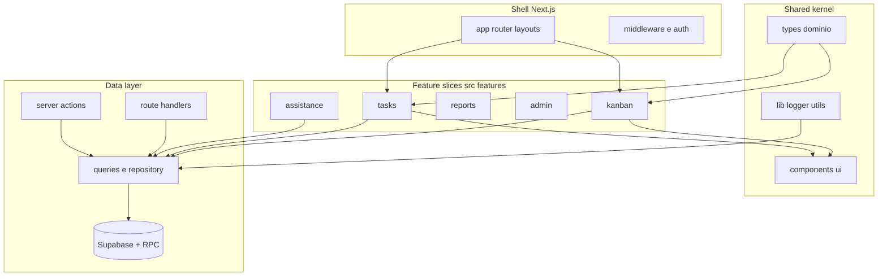

# REPORT FINALE - Audit "Full Data Manager" (2026-04-17)

**Input processato:** 11 sub-report paralleli (4 batch verifica chat `fdm_batch_1..4`, 7 stream audit codice `STREAM-1..7`) + `docs/AUDIT-ARCH-DATA-*` + `docs/chat-exports/`.

**Obiettivo:** piano d'azione unificato, ordinato per ROI, per rendere il manager più **sicuro, efficiente, modulare**.

---

## 1. Sintesi esecutiva (leggere prima di tutto)

1. **Sicurezza multi-tenant** è il rischio più alto: `withSiteAuth` non verifica membership `user_sites`; tabella `Task` con RLS non confermata nelle migrazioni; policy HR (`attendance_entries`, `leave_requests`, `internal_activities`) con `USING (true)`; debug endpoint e storage `files` pubblici. (S1)
2. **Enum DB vs UI non allineati**: `ipg` è usato in UI/API attendance ma **nessuna migration** lo aggiunge ai CHECK (regressione latente). (B3, chat `cursor_modifiche_pagina_presenze` e `cursor_nuovo_modulo_...`)
3. **Overview dashboard**: il refactor descritto in due chat (`DashboardOverviewShell`, zone fisse) non è mai stato applicato. Decidere: ripristinare o dichiarare obsoleta la specifica. (B2)
4. **Performance**: `select("*")` pervasivo in `lib/server-data.ts`, kanban tasks, snapshot, reports; `app/api/users/list` senza filtro tenant; loop N+1 in `app/api/qcItems/[id]`; `fetchClients` fa `limit(500)` sul join Action rendendo "ultima azione" semanticamente errato sotto carico. (S3)
5. **Cache & realtime**: `revalidateTag("kanbans"|"kanban-categories")` **orfani** (nessun producer `unstable_cache`); molti `revalidatePath` non usano il prefisso tenant `/sites/[domain]`; persister key mismatch (`matris-query-cache` vs `matris-query-cache-v2`). (S4)
6. **Transazionalità**: permessi utente fanno delete+insert multi-tabella senza transazione, validazione superadmin *dopo* il delete; duplicate/delete kanban e import CSV con stati parziali; race su sequenze codici interni. (S2)
7. **Modularità**: 13 file >1000 righe (`server-data.ts` 5811, `editKanbanTask.tsx` 2920, `demo/service.ts` 2690, `administration/actions.ts` 2627); duplicati `app/api/api/**`; `modules/` in root è dead-code; `types/database.types.ts` non collegato ai client. (S5)
8. **DX/Test**: 149 route `app/api/**` **zero test**; `collectCoverageFrom` le esclude; `eslint.ignoreDuringBuilds:true`; nessuna CI versionata; `console.*` sparsi in script e route chiave. (S6)
9. **AI/Voice**: nessun timeout su `generateObject`/Whisper; nessun billing/usage per-tenant; **route voice non verificano membership `siteId`** (diverso da `/api/assistants/chat`); `GET /ai-settings` senza auth espone metadati chiavi; chat assistants **non** fa inferenza LLM reale (output deterministico). (S7)

---

## 2. Top 10 interventi prioritari (matrice impatto × effort)

Legenda severity: 🔴 critical | 🟠 high | 🟡 medium. Effort: S ≤ 2gg, M ≈ 1 sprint, L > 1 sprint.

| # | ID master | Titolo | Sev | Effort | Evidenza chiave | Azione |
|---|-----------|--------|-----|--------|------------------|--------|
| 1 | **SEC-A** | `assertUserCanAccessSite` in `withSiteAuth` e in tutte le route `createServiceClient` | 🔴 | M | S1-F01 (`lib/api/with-site-auth.ts:31-58`), F-001 | Unica funzione `assertUserCanAccessSite(userId, siteId)` con query `user_sites`; 403 fail-fast |
| 2 | **SEC-B** | Abilitare RLS su `Task` e correggere policy HR `USING (true)` | 🔴 | L | S1-F02, S1-F03 (migrazioni HR e internal_activities) | Migration che attiva RLS + policy `site_id` + membership |
| 3 | **SEC-C** | Gate ambiente + secret obbligatorio su `/api/debug/**` e `/api/cron/auto-archive` | 🟠 | S | S1-F05, F-006 | Return 404 se `NODE_ENV==='production'` && !secret |
| 4 | **SEC-D** | Voice API: membership `siteId` + timeout + auth su `GET /ai-settings` | 🔴 | S | S7-F06, S7-F07, S7-F01 | Copiare pattern di `/api/assistants/chat`; `AbortSignal.timeout(15000)` |
| 5 | **DB-A** | Migration `ipg` nei CHECK di `attendance_entries` e `leave_requests` | 🟠 | S | B3 matrice stato (manca la migration) | File `2026xxxx_add_ipg_status.sql` allineato a UI/API |
| 6 | **TX-A** | RPC transazionali per permessi, delete/duplicate kanban, replace ruoli timetracking | 🟠 | M | F-005, S2-F001..S2-F004 | 4 RPC descritte in `STREAM-2-data-consistency.md` (tabella RPC candidate) |
| 7 | **PERF-A** | Proiezioni + paginazione su top 5 hotlist (`kanban/tasks`, `reports/time`, `reports/errors`, `kanban/snapshot`, `users/list`) | 🔴 | M | S3 hotlist top 20 | Ridurre `select("*")`, `limit`/`cursor`, filtri `site_id`+data in SQL |
| 8 | **CACHE-A** | Bonifica `revalidateTag` orfani + `revalidatePath` tenant-aware + key persister unica | 🟠 | S | S4-F019, F-008, F-009, F-018 | Centralizzare `queryKeys.*` + mapping tag↔producer reale |
| 9 | **DX-A** | CI GitHub Actions (lint + typecheck + test + build + secret-scan) | 🟠 | S | F-014, S6-F002, S6-F003 | YAML già pronto in `STREAM-6-dx-testing.md`; `npm run typecheck`; riattivare eslint in build |
| 10 | **MOD-A** | Split `lib/server-data.ts` (5811 righe) per dominio + rimozione `app/api/api/**` | 🟡 | M | S5 tabella file monster, F-017 | Facciata sottile `server-data.ts` che re-exporta; redirect 308 per `api/api/*` |

---

## 3. Dipendenze fra interventi (grafo testuale)

```
SEC-A ─┬─► SEC-B (definizione membership usata anche da policy RLS)
       └─► SEC-D (riuso helper per voice API)

DB-A ──► test E2E attendance (sblocca DX-A)

TX-A ──► SEC-A (permessi in transazione, stesso file touch)

PERF-A ─┬─► CACHE-A (proiezioni cambiano anche invalidazioni)
        └─► MOD-A (split server-data apre a colonne per dominio)

DX-A ──► tutti (abilita gate a ogni PR successivo)

MOD-A ─► fase 2: refactor editKanbanTask/Card/KanbanBoard (post-split server-data)
```

**Sequenza consigliata (minimizza rischio regressione):** `DX-A` → `SEC-C` → `SEC-A` → `DB-A` → `SEC-D` → `CACHE-A` → `TX-A` → `PERF-A` → `SEC-B` → `MOD-A`.

---

## 4. Architettura target modulare (proposta)

Dalla proposta dello **Stream 5** (`STREAM-5-modularity.md`), sintesi con diagramma e policy:



**Policy vincolanti** (regole `eslint-plugin-boundaries` o `dependency-cruiser` da aggiungere):

- `app/api/**` e `app/sites/**/actions/**` **non** duplicano logica SQL: entrambi chiamano `src/server/queries/*` o RPC.
- `features/<domain>/*` **non** importa da `app/**`, solo da `server/queries` e `shared`.
- Una sola sorgente di tipi DB (`types/supabase.ts` **oppure** `Database` generated), decisa in M4.
- Una sola cartella migration (`supabase/migrations`): archiviare `supabase-sellproduct-patch/` e `.tmp-safe-migration/`.

---

## 5. Backlog esteso con ID stabili

Nomi normalizzati per tracciamento su issue tracker. Severity/Effort ereditate dai sub-report.

### Sicurezza (Stream 1)
- `S1-F01` Membership sito mancante in `withSiteAuth` — 🟠 M
- `S1-F02` RLS assente su `Task` — 🔴 L
- `S1-F03` Policy HR/internal_activities `USING (true)` — 🟠 M
- `S1-F04` Storage bucket `files`/`site-logos`/`site-images` pubblici — 🟡 M
- `S1-F05` Debug endpoint senza gate ambiente — 🟡 S
- `S1-F06` Duplicato `app/api/api/upload|confirm|domain` — 🟡 S (cross-link F-017, S5-F001 indirettamente)

### Data Consistency (Stream 2)
- `S2-F001` Insert colonne kanban in ciclo senza check errore — 🟠 S
- `S2-F002` Risoluzione identifier univoco via select+retry (TOCTOU) — 🟠 S
- `S2-F003` Delete kanban multi-step senza transazione — 🟠 M
- `S2-F004` Replace ruoli timetracking "continue anyway" su errore insert — 🟡 S
- `S2-F005` Duplicate task senza rollback su errori `TaskSupplier`/`File` — 🟡 M
- `S2-F006` Move task: ramo `movedTask` non controlla errore `Action.insert` — 🟡 S
- `S2-F007` QC/Packing insert paralleli senza rollback parziale — 🟡 M
- `S2-F008` Import CSV sell-products: righe scritte non rollbackate — 🟠 M
- `S2-F009` `getNextInternalSequenceValue` race — 🟠 M (RPC `SELECT … FOR UPDATE`)
- `S2-F010` Import CSV manufacturers senza transazione — 🟡 M

### Performance (Stream 3)
- `S3-F001` `/api/users/list` `select("*")` senza filtro tenant — 🔴 S
- `S3-F002` `/api/reports/time` carica tutto poi aggrega in JS — 🟠 M
- `S3-F003` `/api/reports/errors` filtri date/site in JS — 🟠 M
- `S3-F004` `fetchClients` last action con `limit(500)` semanticamente errato — 🟠 M
- `S3-F005` Indici compositi mancanti su `Task(site_id,...)`, `Timetracking(site_id,created_at)` — 🟡 S
- `S3-F006` Loop N+1 in `qcItems/[id]` — 🟠 S
- Conferma F-010 estesa a `kanban/tasks`, `kanban/snapshot`, `quick-actions/data`, `clients`, `products`, `sell-products`.

### Cache & Realtime (Stream 4)
- `S4-F019` Mismatch persister key `matris-query-cache` vs `matris-query-cache-v2` — 🟡 S
- `S4-F020` `app/getQueryClient.tsx` non importato in nessun RSC — 🟡 S
- `S4-F021` Invalidazioni `["tasks"]`/`["kanban"]` senza query corrispondenti — 🟡 S
- `S4-F022` Board principale sottoscrive solo `Task`, non colonne/board — 🟡 S
- `S4-F023` `isSubscribed` basato su ref → valore spesso fuorviante — 🟡 S
- Conferma F-008/F-009/F-018 in dettaglio.

### Modularità (Stream 5)
- `S5-F001` `modules/` root è dead-code, non referenziato — 🟡 S
- `S5-F002` Presentazione accoppiata a `lib/server-data` — 🟡 M
- `S5-F003` Doppio sistema tipi DB non collegato — 🟡 M
- `S5-F004` Barrel `hooks/index.ts` peggiora bundle — 🟢 S
- Piano split: top 10 file > 1000 righe con strategia dedicata (vedi tabella Stream 5).

### DX/Testing/Observability (Stream 6)
- `S6-F001` Coverage esclude `app/api/**` per configurazione — 🟡 S
- `S6-F002` Lint bypassato in build Next — 🟡 S
- `S6-F003` Manca `npm run typecheck` script — 🟢 S
- CI YAML proposto pronto; suite minima (P0: kanban/tasks/move, import CSV, cron).

### AI/Voice (Stream 7)
- `S7-F01` Nessun timeout LLM/Whisper — 🟠 S
- `S7-F02` Nessun retry/backoff su LLM — 🟡 M
- `S7-F03` Nessun tracking usage per-tenant — 🟠 M
- `S7-F04` Prompt voice sparsi invece che centralizzati — 🟡 S
- `S7-F05` Chat assistants senza LLM reale (decisione prodotto) — 🟢 -
- `S7-F06` Voice API senza membership `siteId` — 🔴 S
- `S7-F07` `GET /ai-settings` senza auth, esposizione metadati — 🟠 S
- `S7-F08` Memoria assistants `Map` in-process — 🟡 M
- `S7-F09` `AssistantRegistry` con path assoluti dev machine — 🟢 S

### Verifica chat (Batch 1-4)
- **B1**: `NEXT_PUBLIC_FORCE_LOCAL_CARD_PREFS` promesso ma assente nel repo; card compressa con codice come `<span>` (non cliccabile); sfondo modale diverso dallo stato "slate" discusso; bottone "Reset preferenze Kanban" mancante.
- **B2**: `DashboardOverviewShell` e il layout rigido **mai implementati**: decidere rollback documentale o implementazione.
- **B3**: `ipg` in UI/API ma **manca migration**; `LEAVE_TYPE_LABELS.smart_working` incoerente con griglia "Festivo"; `lib/tabular-report-export.ts` non allineato a timezone policy.
- **B4**: allineamento PDF/settings OK; push remoto e kill-porta non verificabili da codice.

---

## 6. KPI misurabili e gate di accettazione

| Area | KPI | Target |
|------|-----|--------|
| Sicurezza | % route `createServiceClient` con `assertUserCanAccessSite` | 100% |
| Sicurezza | RLS attiva su tabelle multi-tenant core (`Task`, HR) | 100% |
| Sicurezza | `/api/debug/**` + `/api/cron/**` esposti in produzione | 0 |
| Consistenza | Flussi business critici senza RPC/transazione | 0 sui 5 flussi top |
| Performance | Endpoint lista con `select("*")` senza paginazione | 0 sulle 10 API ad alto volume |
| Cache | `revalidateTag` orfani (no producer) | 0 |
| DX | Route `app/api/**` con copertura test | ≥ 30% sui flussi P0 |
| DX | CI gate su ogni PR | presente e verde |
| AI | Route voice con timeout + membership | 100% |
| AI | Tracking usage per-tenant | presente e aggregato |

---

## 7. Domande aperte da risolvere prima di aprire issue

1. **RLS in produzione**: `Task` ha RLS applicata fuori repo o lo schema deployato coincide con le migrazioni Git?
2. **Overview dashboard**: manteniamo la specifica `DashboardOverviewShell` o chiudiamo come obsoleta?
3. **`modules/` root**: si archivia o c'è uno script esterno che lo usa?
4. **Bucket storage**: i file in `files` devono restare pubblici o passano a signed URL?
5. **Import CSV**: policy `rollback globale` vs `commit per riga`?
6. **Chat assistenti**: si integra un LLM reale o resta output deterministico?
7. **Billing AI**: chi sponsorizza `OPENAI_API_KEY` per siti senza BYOK? Quote per tenant?
8. **Lint in build**: accettiamo la rimozione di `ignoreDuringBuilds` target oppure lo teniamo con lint CI-only?

---

## 8. Riferimenti

- Sub-report: `STREAM-1-security.md`, `STREAM-2-data-consistency.md`, `STREAM-3-performance.md`, `STREAM-4-cache-realtime.md`, `STREAM-5-modularity.md`, `STREAM-6-dx-testing.md`, `STREAM-7-ai-voice.md`.
- Verifica chat: `fdm_batch_1_report.md`, `fdm_batch_2_report.md`, `fdm_batch_3_report.md`, `fdm_batch_4_report.md`.
- Audit preesistente: `docs/AUDIT-ARCH-DATA-CHECKLISTS.md`, `docs/AUDIT-ARCH-DATA-FINDINGS-BACKLOG.md`, `docs/AUDIT-ARCH-DATA-OPTIMIZATION-ROADMAP.md`.
- Backlog unificato chat+audit: `docs/CHAT-EXPORTS-MASTER-BACKLOG.md`.
- Export chat originali (redatti): `docs/chat-exports/` (indice in `INDEX.md`).
- Scan sicurezza redazioni: `docs/chat-exports/SECURITY-SCAN-2026-04-17.md`.
