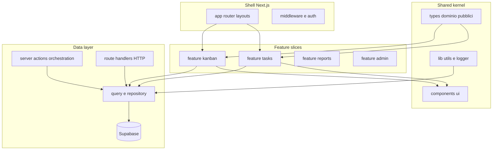

# Stream 5 - Modularity & Boundaries

## Sommario esecutivo

Il “Full Data Manager” oggi concentra **accesso dati**, **UI di dominio** e **route HTTP** in pochi file molto grandi (`lib/server-data.ts` ~5811 righe, `editKanbanTask.tsx` ~2920). Esiste un **doppio canale** dati (REST `app/api/**` e Server Actions `app/sites/**/actions/**`) con logica ripetuta su task/kanban/permessi. La cartella **`modules/`** in root è un **layer di servizi legacy** (solo `package/service.tsx` + import relativi) **senza consumatori** nel codice applicativo. I tipi DB sono **duplicati concettualmente**: `types/supabase.ts` è usato ovunque; `types/database.types.ts` (gen Supabase) **non risulta collegato** ai client. Path **duplicati e rischiosi**: `app/api/api/**` replica route canoniche; `supabase-sellproduct-patch/` e `.tmp-safe-migration/` duplicano alberi migration rispetto a `supabase/migrations` (F-013). **Barrel** (`hooks/index.ts`, `lib/api/index.ts`, vari `components/dashboard/*/index.ts`) con `export *` favorisce import “a peso intero” laddove il bundler non tree-shake-a in modo fine.

---

## File monster top 10 (tabella: file | linee | funzioni | piano split)

Righe misurate con conteggio righe su filesystem; “funzioni” = stima euristica (dichiarazioni `function` / `const x = (` a riga iniziale).

| file | linee | funzioni (stima) | piano split |
|------|-------|-------------------|-------------|
| `/Users/matteopaolocci/santini-manager/lib/server-data.ts` | 5811 | ~46 | Spezzare per **dominio** (`site-context`, `dashboard/*`, `kanban`, `projects`, …); estrarre **tipi pubblici** in `types/` o `lib/server-data/*.types.ts`; una facciata sottile `server-data.ts` che re-exporta. |
| `/Users/matteopaolocci/santini-manager/components/kanbans/editKanbanTask.tsx` | 2920 | ~26 | Sotto-componenti: **header/metadata**, **tabs sezioni** (offerta/lavori/allegati), **form fields** per tipo task, **hooks** (`useEditKanbanTask*`), **mutazioni** delegate a moduli `lib/kanban/*` o feature `features/kanban/`. |
| `/Users/matteopaolocci/santini-manager/lib/demo/service.ts` | 2690 | ~50 | Separare **API pubblica** vs **step di seed** vs **policy token**; file per **workspace lifecycle**, **audit**, **template application**. |
| `/Users/matteopaolocci/santini-manager/app/(administration)/administration/actions.ts` | 2627 | ~48 | Split per **area** (sites, users, orgs) in `actions/*.ts`; condividere solo helper `lib/admin/`. |
| `/Users/matteopaolocci/santini-manager/components/kanbans/KanbanBoard.tsx` | 1833 | ~25 | Estrarre **colonne**, **Dnd**, **toolbar**, **realtime subscription** in file dedicati. |
| `/Users/matteopaolocci/santini-manager/components/app-sidebar.tsx` | 1725 | ~12 | Già “layout”; spezzare **definizione menu** (data) da **render**; estrarre sezioni per modulo. |
| `/Users/matteopaolocci/santini-manager/app/api/voice-input/command/route.ts` | 1426 | ~24 | Router sottile + **handler per intent** + **validazione** + **side-effect** in `lib/voice-input/*`. |
| `/Users/matteopaolocci/santini-manager/components/timeTracking/create-page.tsx` | 1346 | ~17 | Form steps, tabella riepilogo, validazione in componenti/hook separati. |
| `/Users/matteopaolocci/santini-manager/components/reports/GridReports.tsx` | 1336 | ~20 | Separare **config colonne/filtri** da **grid UI**; eventuali aggregazioni in `lib/reports/*`. |
| `/Users/matteopaolocci/santini-manager/components/kanbans/Card.tsx` | 1333 | ~13 | Sotto-card per **offerta**, **lavoro**, **badge**, **menu azioni**; logica di stato in hook. |

**Nota:** nel repo ci sono **13** file `>=1000` righe; oltre al top 10: `projects/editForm.tsx` (~1297), `GlobalVoiceAssistant.tsx` (~1280), `calendar-utils.ts` (~1157). `GlobalSupportAssistant.tsx` (~517 righe) è voluminoso ma **sotto la soglia 1000** — utile da modulare ma non entra nel “top 10” per dimensione.

---

## Duplicazioni (tabella: copia A | copia B | evidenza | azione)

| copia A | copia B | evidenza | azione |
|---------|---------|----------|--------|
| `app/api/confirm/route.ts` | `app/api/api/confirm/route.ts` | Stesso flusso `verifyOtp` e redirect (`/Users/matteopaolocci/santini-manager/app/api/confirm/route.ts:1` vs `.../app/api/api/confirm/route.ts:1`, contenuto allineato riga per riga nella porzione letta). | Deprecare `/api/api/confirm`, redirect 308 o rimozione; client solo su `/api/confirm`. |
| `app/api/upload/route.ts` | `app/api/api/upload/route.ts` | Stesso handler Vercel Blob (`.../upload/route.ts:1` vs `.../api/upload/route.ts:1`). | Un solo endpoint documentato; l’altro alias deprecato. |
| `app/api/domain/[slug]/verify/route.ts` | `app/api/api/domain/[slug]/verify/route.ts` | Stesso uso di `getDomainResponse` / `getConfigResponse` (`.../domain/[slug]/verify/route.ts:1` vs `.../api/domain/[slug]/verify/route.ts:1`). | Allineare client e documentazione; rimuovere duplicato (F-017). |
| Pattern creazione/gestione task kanban | Pattern in Server Actions e in API | Esempio: logica duplicazione/insert in `app/api/kanban/tasks/create/route.ts` (retry codice univoco, insert `Task`) e in `app/sites/[domain]/kanban/actions/duplicate-item.action.ts` (select/insert su `Task`). Move task: `app/api/kanban/tasks/move/route.ts` (centinaia di righe side-effect). | Introdurre **use-case** condivisi in `lib/domain/kanban/` o RPC SQL chiamata da **sia** route **sia** `actions` (coerente con Area C checklist). |
| `lib/permissions.ts` vs route permessi | Duplicazione concettuale read/write permessi | `app/api/sites/[domain]/users/[userId]/permissions/route.ts` importa tipi da `@/types/supabase` e orchestra DB; `lib/permissions.ts` gestisce moduli/kanban lato server (`/Users/matteopaolocci/santini-manager/lib/permissions.ts` vs route citata nel backlog F-005). | Unificare **servizio permessi** unico + thin adapter per HTTP vs server action. |

---

## Proposta target architecture

Obiettivo: **feature-slice** per dominio (kanban, tasks, inventory, admin, demo), con **shell** Next.js sottile, **data access** esplicito (repository / query modules), **nessun secondo albero migration** fuori `supabase/migrations`.

### Diagramma Mermaid

### Struttura cartelle proposta (indicativa)

- `src/features/<domain>/{components,hooks,server,api.ts}` — UI e orchestrazione dominio.
- `src/server/queries/<domain>/*.ts` — Supabase/RPC, niente JSX.
- `src/app/**` — solo route, composizione, `revalidate*`.
- `types/` — **un** ingresso tipi DB (vedi F-016): o solo generated `Database` + tipi dominio sottili, o solo manuali ma documentati.
- `supabase/migrations/` — unica sorgente (M4 roadmap).

### Mapping as-is → to-be

| As-is | To-be |
|-------|--------|
| `lib/server-data.ts` monolite | `server/queries/*` + tipi esportati per pagina/feature |
| `app/api/**` + `app/sites/**/actions/**` con SQL duplicato | Stessi **use-case** in `server/queries` o RPC; route/actions solo I/O |
| `modules/*` (root) non referenziato | Eliminare o migrare verso `server/queries` se ancora necessario |
| `components/kanban/*.tsx` enormi | `features/kanban/components/*` + hook |
| `app/api/api/**` | Rimosso o proxy deprecato verso route canoniche |
| `types/supabase.ts` + `types/database.types.ts` | Policy unica (F-016, M4) |

---

## Findings nuovi S5-F&lt;NN&gt;

| ID | Evidenza | Nota |
|----|-----------|------|
| **S5-F001** | `modules/**/*.ts` importano solo `../../../package/service` e Supabase; **nessun** import da `app/`, `components/`, `@/*` verso `modules/` trovato in scansione. | Layer **orfano / dead code** ad alto rischio di drift (es. `modules/tasks/service/get.ts` usa tabella `"task"` minuscolo vs `"Task"` altrove). |
| **S5-F002** | `components/dashboard/*`, `components/kanbans/*`, ecc. importano tipi/stats da `@/lib/server-data` (`grep` multipli). | **Accoppiamento presentazione ↔ mega-layer dati**; meglio tipi in `types/` o `features/*/types`. |
| **S5-F003** | `types/database.types.ts` esiste ma i client in `utils/supabase/*.ts` non usano `Database` generato (`grep` su `createClient<` solo nel file types). | **Doppio sistema tipi**: uno generato non integrato, uno manuale ampiamente usato (`types/supabase.ts` ~886 righe). |
| **S5-F004** | Barrel `hooks/index.ts` con `export *` da molti hook (`/Users/matteopaolocci/santini-manager/hooks/index.ts:5`). | Rischio bundle più grande se si importa `@/hooks` intero; preferire import per file. |
| **S5-F005** | `.tmp-py/` **non presente** nel workspace (glob 0 file). | Solo menzione checklist: nessun artefatto da auditare qui. |

---

## Findings audit esistenti confermati (F-017, F-013, F-020)

| ID | Conferma |
|----|----------|
| **F-017** | Presenti almeno `app/api/api/upload/route.ts`, `app/api/api/confirm/route.ts`, `app/api/api/domain/[slug]/verify/route.ts` oltre alle route canoniche sotto `app/api/` senza doppio `api/`. Evidenza: stesso contenuto letto per `confirm` e `upload`. |
| **F-013** | `supabase-sellproduct-patch/supabase/migrations/*.sql` e `.tmp-safe-migration/supabase/migrations/*.sql` esistono accanto a `supabase/migrations` (backlog già elenca path). |
| **F-020** | Coesistenza naming (`Task` PascalCase in SQL/types vs tabelle snake_case documentate nel backlog) resta un tema trasversale; non contraddice la roadmap M4 (governance schema). |

---

## Quick wins

1. **Deprecare** o rimuovere route sotto `app/api/api/**` con redirect verso equivalenti `/api/*` (F-017).
2. **Documentare** un solo URL per upload/confirm/domain-verify e aggiornare client.
3. **Import mirati**: sostituire `import { X } from "@/hooks"` con `@/hooks/use-api` ecc. dove il barrel appesantisce.
4. **Segnare** `modules/` come legacy in README interno o eliminare se confermato inutilizzo (S5-F001).

---

## Interventi strutturali (roadmap 1-2 sprint con ordine suggerito)

**Sprint 1 (confini e drift)**  
1. Consolidare **migration tree** solo `supabase/migrations` (M4, F-013).  
2. Rimuovere duplicati **`app/api/api/**`** (F-017).  
3. Policy **tipi DB** (F-016): collegare `Database` ai client *oppure* eliminare file generato non usato.  
4. Tagliare il primo blocco da **`lib/server-data.ts`**: almeno `dashboard/*` e `site context` in file separati.

**Sprint 2 (dominio e UX)**  
1. Estrarre **use-case kanban/task** condivisi tra API e actions (Area C).  
2. Refactor **`editKanbanTask.tsx` / `Card.tsx` / `KanbanBoard.tsx`** verso feature folder.  
3. **`lib/demo/service.ts`**: split per responsabilità o confinamento dietro flag feature.

---

## Contraddizioni con la roadmap

- La roadmap **M1** non cita esplicitamente la bonifica **`app/api/api/**`**, mentre il backlog la classifica (F-017, low S). Convivenza: M1 può includere “contratti API” senza conflitto — è un **gap di priorità**, non logico.
- **M4** chiede tipi DB unificati; oggi **`database.types.ts` non è nel grafo di import runtime** — il deliverable M4 richiede **più che rinominare file** (integrazione o scarto).

---

## Domande aperte

1. **`modules/`** è ancora richiesto da build esterna o script non nel repo? Se no, si può archiviare.  
2. **`lib/demo/service.ts`** in produzione: volume 2690 righe giustifica split anche se solo per demo?  
3. Preferenza **unica** per dati: **RPC-first** (M2) vs **TypeScript repository** condiviso tra route e actions?  
4. Client e integrazioni esterne: quali URL sono ancora configurati verso **`/api/api/*`**?

---

**Riferimenti checklist:** `docs/AUDIT-ARCH-DATA-CHECKLISTS.md` (aree C: linee 27–35, D: linee 37–46). **Roadmap:** `docs/AUDIT-ARCH-DATA-OPTIMIZATION-ROADMAP.md` (M2–M4). **Backlog:** `docs/AUDIT-ARCH-DATA-FINDINGS-BACKLOG.md` (F-013, F-016, F-017, F-020).
